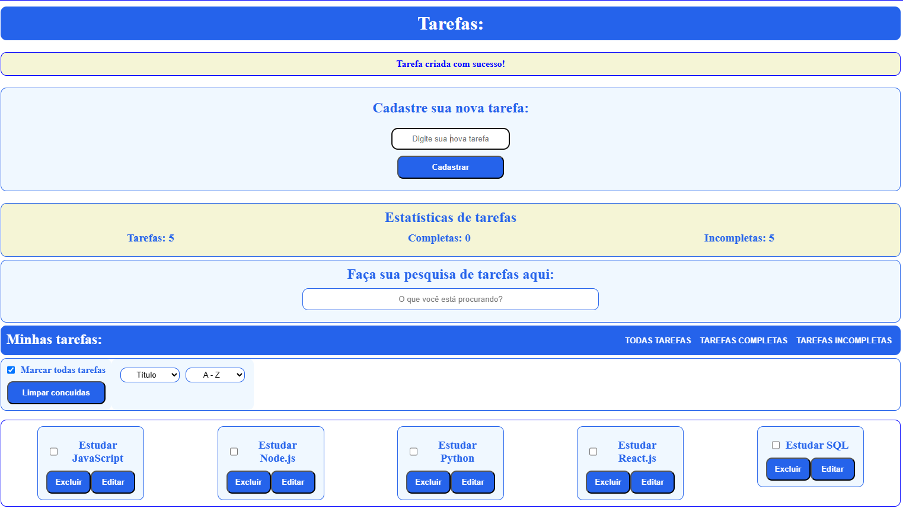
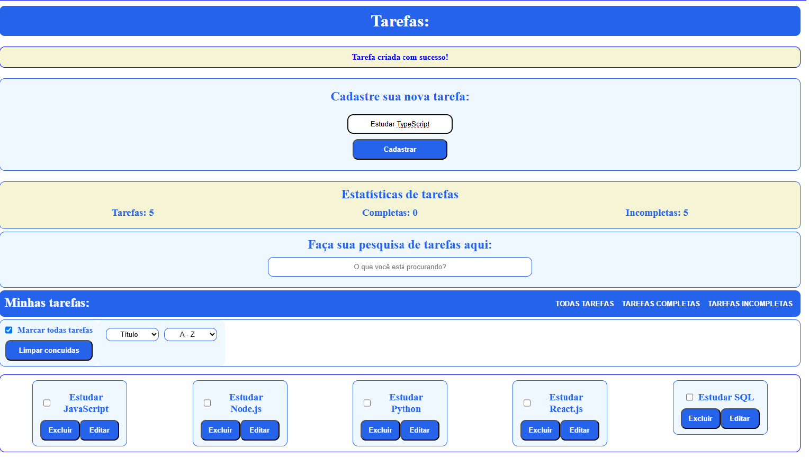
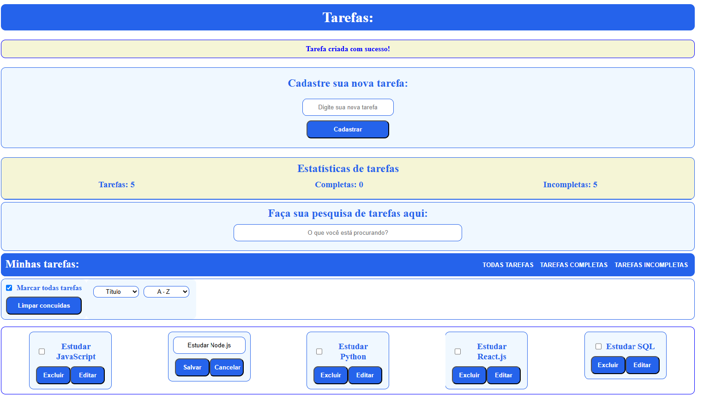
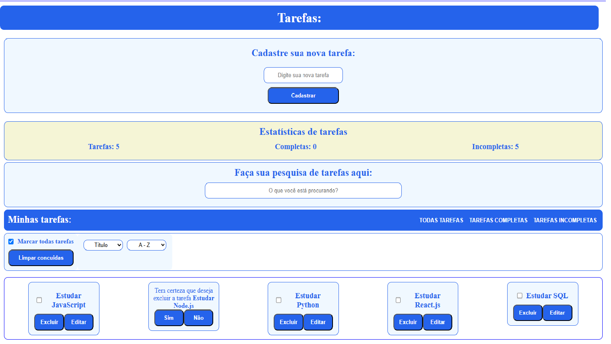
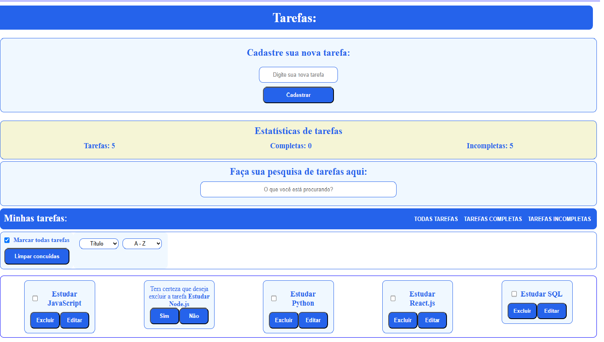
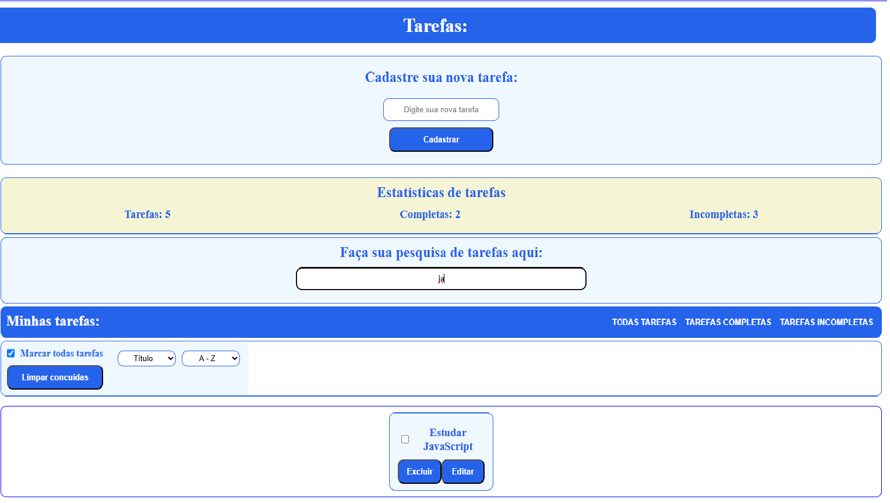
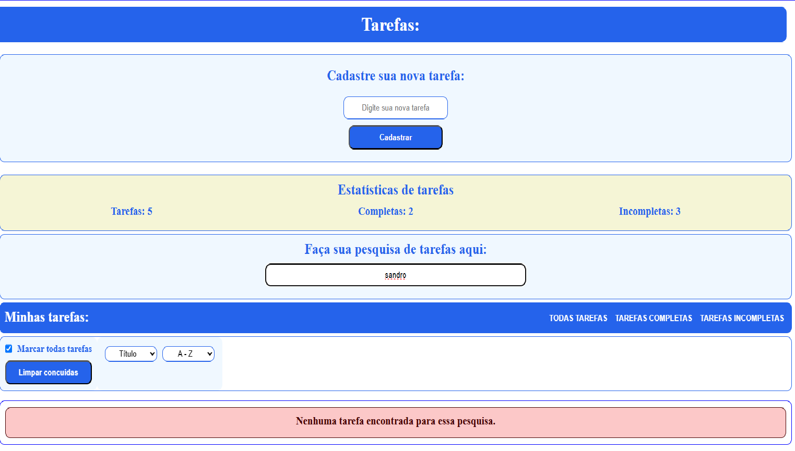
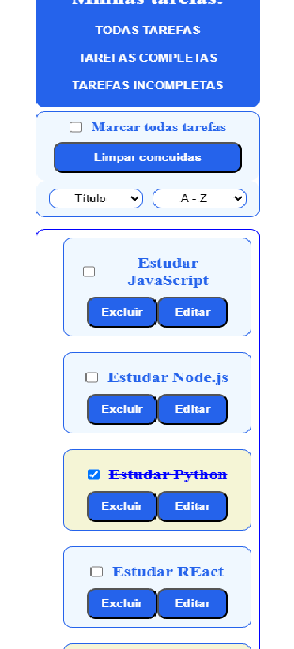

# Todo List Full Stack

Descrição

Sistema de ciração de tarefas deenvolvido como projeto para Portfólio de GitHub

✨ Funcionalidades

CRUD completo de tarefas,
Estatisticas com dados de tarefas completas a completar e todas,
Pesquisa de tarefas já cadastradas
Filtro que permite vizualizar todas tareafa, completas e incompletas,
Oredençaõ por título e por nome,

🛠 Tecnologias

Trata-se de uma SPA com as seguintes tecnologias:
backend: Node.js banco de dados em MySQL com a ORM sequelize,
frontend: React.js

📸 Capturas de tela
### Home

### Criar tarefa

### Editando tarefa

### Excluir tarefa

### Filtrar tarefa

### Pesquisar tarefa

### Estado vazio

### Responsividade

📂 Estrutura do projeto

pasta base:
  -backend:
    -src:
      -controllers,
      -database,
      -middlewares,
      -models,
      -routes,
      -server.js
  -forntend:
    -src:
      -components,
      -hooks,
      -pages,
      -services,
          
🚀 Como executar

Requisitos:
-vs code ou semelhante  com Node.js instalado,
-MYSQL com XAMPP por exemplo ou outra configuração,

Execução:
-Na pasta base passe o comando npm install para instalar as bibliotecas do package-json
-abra um terminal integrado para backend e dentro dele execute npm start
-abra um terminal integrado para frontend e dentro dele execute npm start

📚 Aprendizados

-Mudança visual em botões ao clicar
-Criaçãod e checkbox
-filtros
-ordenamentos
-organização de frontend

👨‍💻 Autor

Sandro da Paixão Coelho
